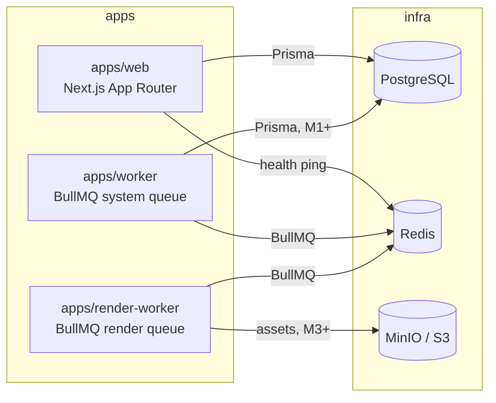

# Архітектура Ormilo Growth OS

Нормативне джерело — [повне ТЗ](ormilo_growth_os_technical_spec_ua.md); цей документ
описує, як вимоги ТЗ реалізовано в коді.

## Загальний підхід

**Modular monolith** + окремі background-процеси. Один deployable web-застосунок
(Next.js), один загальний worker (BullMQ) і один render-worker (Remotion/FFmpeg,
з M3). Мікросервіси не використовуються; межі модулів проходять через workspace-пакети.



## Пакети та правила залежностей

| Пакет | Відповідальність | Може залежати від |
| ----- | ---------------- | ----------------- |
| `@ormilo/contracts` | Zod-схеми та константи, спільні для процесів (health, черги, пізніше — API contracts) | `zod` |
| `@ormilo/domain` | Чиста доменна логіка: Result, DomainError, DomainEvent (пізніше — entities, policies) | — |
| `@ormilo/config` | Валідація env (Zod), типізований доступ до конфігурації | `zod` |
| `@ormilo/observability` | Logger (pino + redaction), health-check утиліти, health HTTP-сервер | `contracts` |
| `@ormilo/db` | Prisma schema, клієнт-фабрика | `@prisma/client` |
| `@ormilo/integrations` | Adapter-інтерфейси зовнішніх систем (AI providers; далі Shopify/Meta/Supplier) | `zod`, `contracts`, `domain` |
| `@ormilo/templates` | Формати креативів; далі — React/Remotion templates | — |
| `@ormilo/ui` | Спільні UI-примітиви (cn, Button; далі shadcn/ui) | `react` |
| `@ormilo/test-utils` | Хелпери для тестів | — |

Жорсткі правила (з брифу):

1. Бізнес-логіка не живе в React components — лише в domain/services.
2. Domain-пакети **не** імпортують Next.js.
3. Зовнішні системи — лише через adapter-інтерфейси з `integrations`.
4. Усі зовнішні payloads (env, queue jobs, webhooks, AI outputs) проходять Zod.
5. Браузер ніколи не викликає AI/Shopify/Meta/supplier API — лише server-side.
6. `any` заборонено (ESLint error), окрім ізольованих SDK-boundary місць.

## Конфігурація

`packages/config` — єдина точка читання `process.env`:

- схема з дефолтами для local development (збігаються з `infra/docker-compose.yml`);
- середовище деплою визначає **`APP_ENV`** (не `NODE_ENV` — його Next.js ставить
  сам у `next build`/`next start`); `APP_ENV=production` вимагає **явних** значень
  критичних змінних (див. `REQUIRED_IN_PRODUCTION`) — production не стартує на
  dev-дефолтах;
- порожні рядки трактуються як відсутні значення;
- повідомлення про помилки не містять значень (секрети не витікають);
- `SHOPIFY_API_VERSION` живе тут (`2026-07`), а не в коді.

Валідація виконується на bootstrap процесу (runtime), а не під час build.

## Черги (BullMQ)

- Назви черг/job-типів — константи в `@ormilo/contracts` (`QUEUES`, `JOBS`).
- Payload кожного job має Zod-схему; процесор валідує на вході.
- Обробники idempotent; repeatable-роботи реєструються через `upsertJobScheduler`
  (повторний старт не дублює).
- Невідомий job-тип → типізована `UnknownJobTypeError` → job у failed (без тихого
  ігнорування). Політика attempts/backoff/DLQ розширюється в M1 разом із outbox.

## Health / Observability

- `apps/web`: `GET /api/health` → `HealthReport` (database + redis), `200 ok` /
  `503 degraded`.
- worker-и: вбудований HTTP-сервер `GET /health` (порти 3001/3002) з redis-перевіркою.
- Формат звіту — контракт `healthReportSchema` в `@ormilo/contracts`, спільний для
  всіх процесів і перевірений тестами та E2E.
- Логи: pino, JSON, обовʼязкова редакція секретів і PII (`SENSITIVE_LOG_PATHS`);
  людиночитаний вивід — лише в development (`pino-pretty`).

## Approval-first (наскрізний принцип)

Кожна небезпечна дія (публікація, ціни, реклама, замовлення постачальнику, ризикові
claims, refund-відповіді) проходить через Approval Queue (модель — M1). Технічні
запобіжники: Shopify products створюються як Draft, Meta-обʼєкти — Paused, supplier
orders у development заборонені на рівні конфігурації середовища.

## Збірка та інструменти

- **Turborepo**: `build` (libs → tsc у `dist/`, web → `next build`), `typecheck`,
  `lint` (ESLint 9 flat config, спільний root-конфіг), `test` (Vitest per-package),
  `e2e` (Playwright, apps/web).
- Пакети публікують ESM із `dist/` + `.d.ts`; залежні задачі отримують готові
  артефакти через `dependsOn: ["^build"]`.
- `@ormilo/db#build` не кешується: `prisma generate` пише клієнт у `node_modules`.
- CI (GitHub Actions): install → lint → typecheck → test → build, окремий job — E2E.

## Структура директорій

```
apps/
  web/            Next.js App Router (UI, API routes)
  worker/         системна черга BullMQ + health server
  render-worker/  render-черга (Remotion/FFmpeg з M3) + health server
packages/
  config/         env-схема та завантаження конфігурації
  contracts/      Zod-контракти між процесами
  db/             Prisma schema + клієнт
  domain/         доменні примітиви й логіка
  integrations/   adapter-інтерфейси зовнішніх систем
  observability/  logger, health, health-server
  templates/      формати креативів (далі — шаблони)
  test-utils/     тестові хелпери
  ui/             спільні UI-компоненти
infra/            docker/ і scripts/ (ТЗ §5; compose — у корені repo)
docs/             ТЗ, план, setup, assumptions, ризики, архітектура
```
